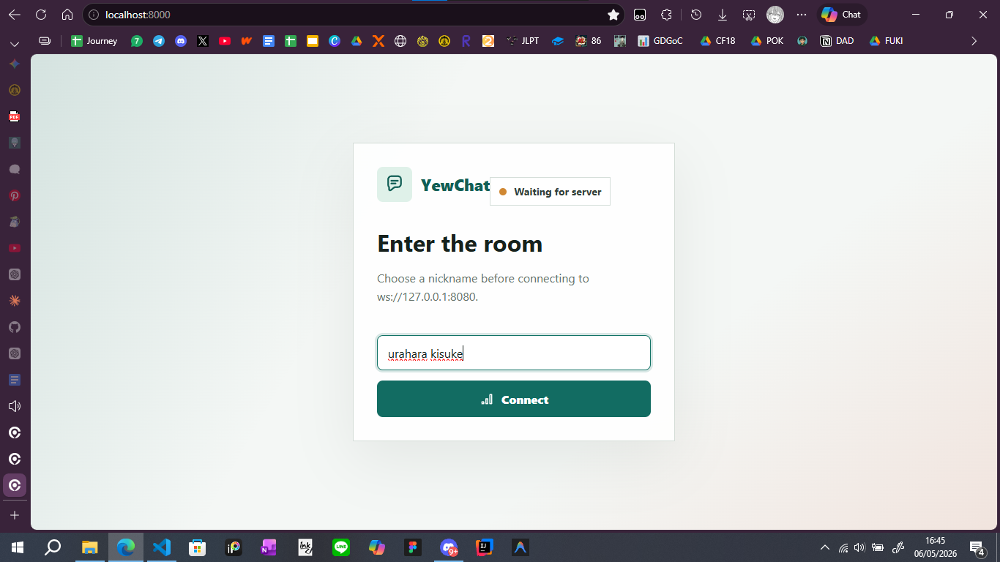
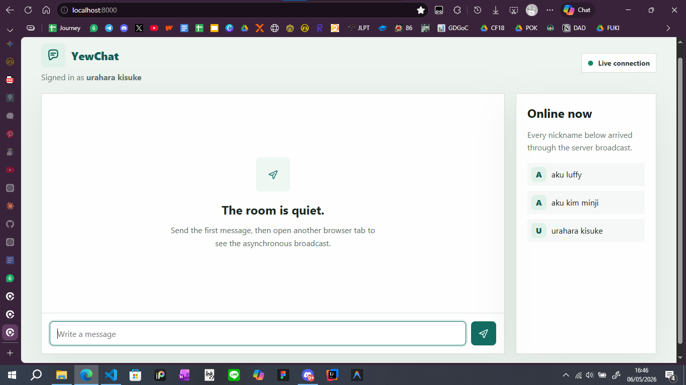
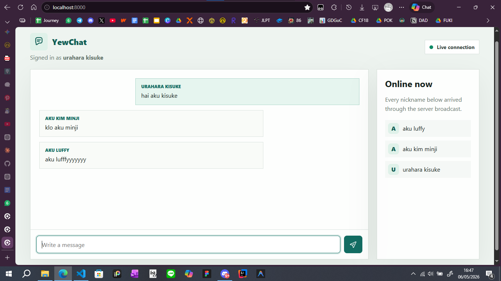
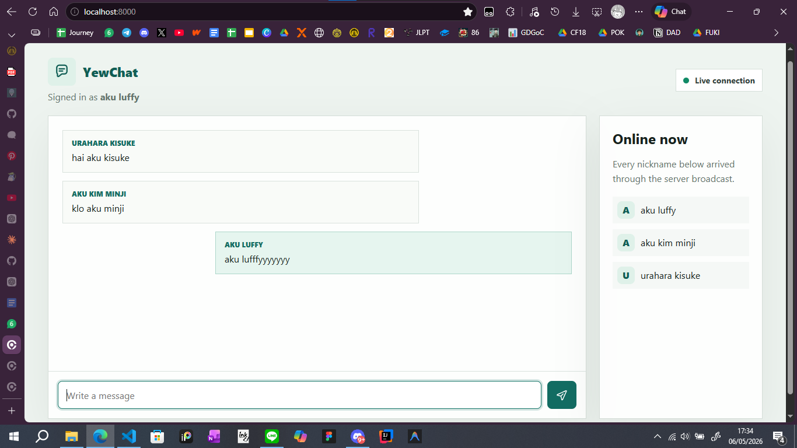

# YewChat 💬

> Source code for [Let’s Build a Websocket Chat Project With Rust and Yew 0.19 🦀](https://fsjohnny.medium.com/lets-build-a-websockets-project-with-rust-and-yew-0-19-60720367399f)

## Install

1. Install the required toolchain dependencies:
   ```npm i```

2. Follow the YewChat post!

## Branches

This repository is divided to branches that correspond to the blog post sections:

* main - The starter code.
* routing - The code at the end of the Routing section.
* components-part1 - The code at the end of the Components-Phase 1 section.
* websockets - The code at the end of the Hello Websockets! section.
* components-part2 - The code at the end of the Components-Phase 2 section.
* websockets-part2 - The code at the end of the WebSockets-Phase 2 section.

## Improvement






I've revamped the original YewChat, which initially had a fairly basic single-page layout where the nickname entry and the chat display were cramped together, to a much sleeker and more professional multi-page experience. I introduced a dedicated lobby page to handle user authentication before entering the room, keeping that minimalist aesthetic I love while providing a clear explanation of the client-server flow and the WebSocket target. To ensure a more robust and independent build, the flow was adjusted so `wasm-pack` generates browser-native WebAssembly output first, followed by Webpack copying those files into the `dist` directory. Furthermore, I completely refactored the chat interface to include dynamic message bubbles that shift based on the user's point of view, making the conversation feel way more natural. The UI was further enhanced with an online-user panel, connection status badges, and simple inline icons, all powered by a local stylesheet in `static/styles.css` to remove the dependency on Tailwind CDN.
