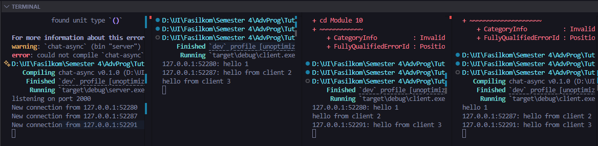

## How to Run

1. Jalankan Server   
- Buka terminal di direktori proyek  
- Jalankan perintah `cargo run --bin server` untuk mengaktifkan server yang akan mendengarkan pada port 2000.

2. Buka Terminal Baru  
- Buka beberapa jendela terminal terpisah untuk menjalankan beberapa client secara bersamaan.

3. Jalankan Client  
- Di setiap terminal baru tersebut, jalankan perintah `cargo run --bin client`.

### Run One Server with Three Clients

When I type some text in one of the clients, that message is sent to the server and then broadcasted to all other connected clients. For example, when I type a message in Client 1, it appears in the terminal of Client 2 and Client 3, labeled with the sender's specific socket address. Based on the implementation, the server uses `tokio::select!` to concurrently handle receiving messages from a client and broadcasting them, while also listening for messages from other clients via the broadcast channel. I also noticed that the code prevents the message from being sent back to the original sender to avoid redundancy. This asynchronous flow ensures that all clients can communicate in real-time without blocking each other’s input or output.

### Modifying Port
Yes, both the server and the client use the same WebSocket protocol, which is evident from the `ws://` prefix in the connection string and the use of the `tokio_websockets` crate to handle the communication. Both are defined within the source code where the connection is established. Specifically, the protocol is handled in `src/bin/server.rs` through the `ServerBuilder` and in `src/bin/client.rs` within the `Uri::from_static definition`. Therefore, I have to modify both files to ensure the application still runs properly after changing the port to 8080. In the server side, I changed the binding address to `"127.0.0.1:8080"`, and in the client side, I updated the connection URI to `"ws://127.0.0.1:8080"`. Since a network connection involves at least two sides, failing to update both would prevent the client from reaching the server, as they would no longer be communicating through the same designated way.